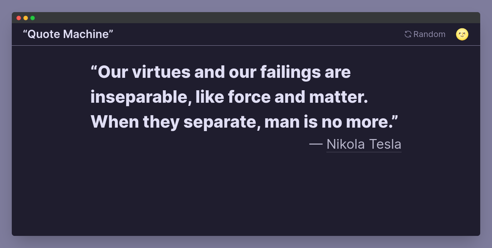
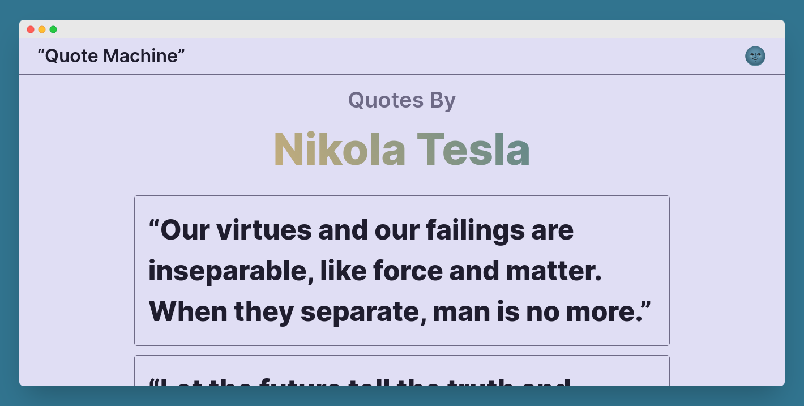

<div align="center">
	<a href="https://quote-machine-dni9.vercel.app">
		
	</a>
	<br />
	<h3>
		Quote Machine
	</h3>
	<p>
		A simple app to get random quotes from different genre
	</p>
</div>
<br>

[](https://quote-machine-dni9.vercel.app)
[](https://quote-machine-dni9.vercel.app/author.html?author=nikola-tesla)

---

## Setup / Installation

Clone this repo and cd into it

```sh
git clone https://github.com/DNI9/quote-machine.git
```

Install dependencies

```sh
yarn
```

## Run locally

Develop

```sh
yarn dev
```

To build

```sh
yarn build
```

## Links

[Quote API](https://github.com/lukePeavey/quotable)

[Rose Pine theme](https://rosepinetheme.com/)
